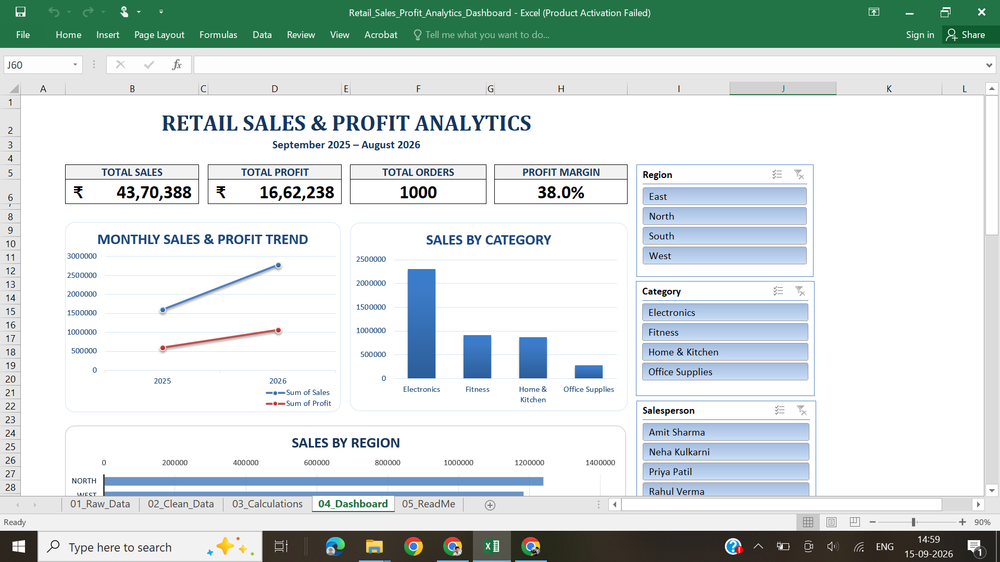
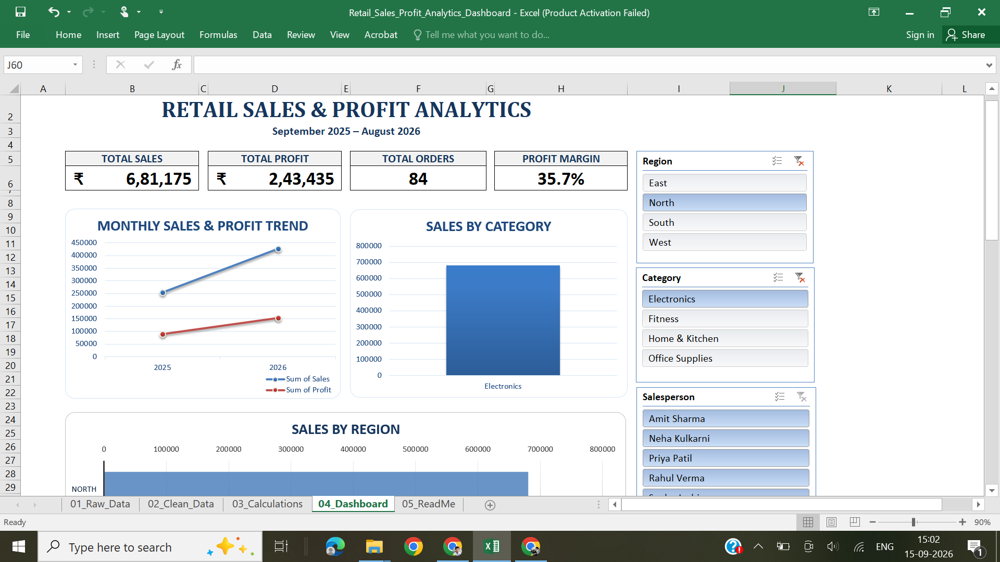
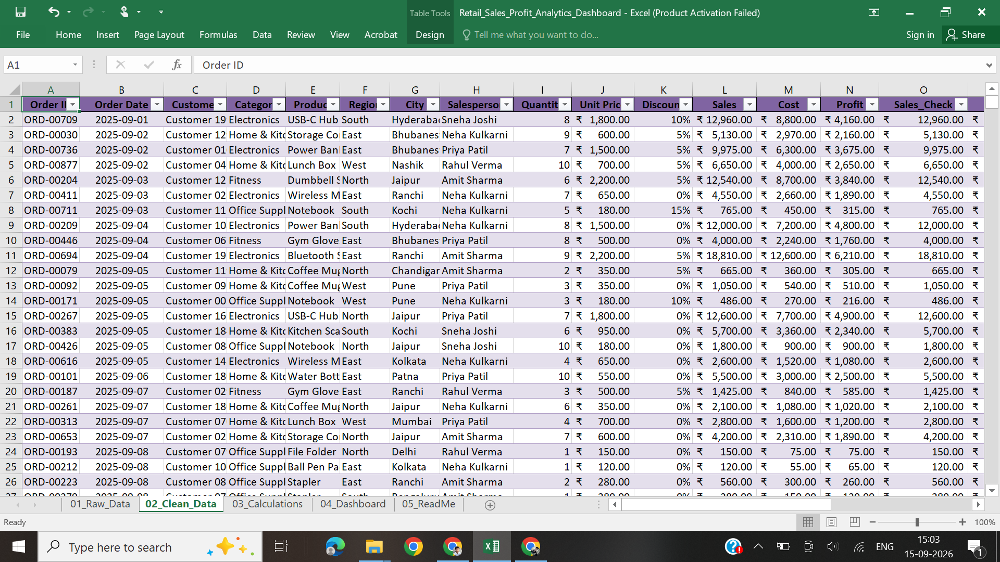
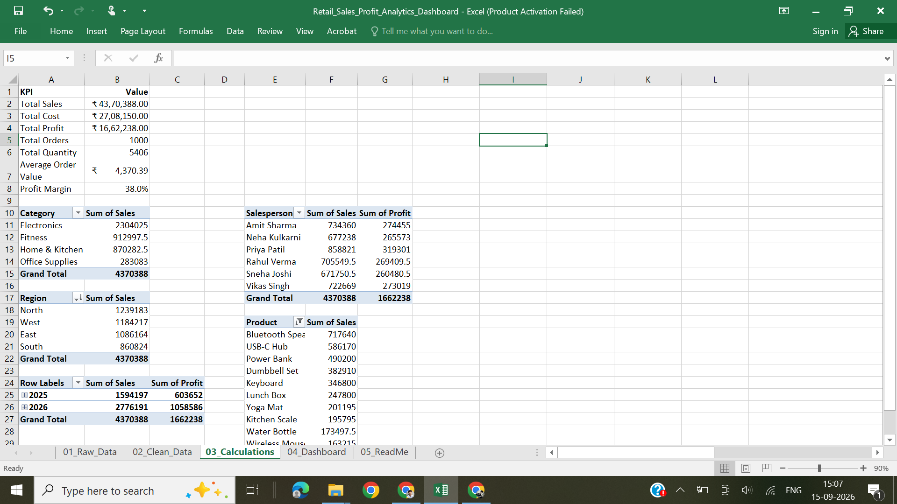

# Retail Sales & Profit Analytics Dashboard

## 📊 Project Overview

An interactive Retail Sales & Profit Analytics Dashboard developed in Microsoft Excel.

The project transforms raw retail transaction data into an interactive business intelligence dashboard that helps users monitor sales, profitability, regional performance, category performance, salesperson performance, and product performance.

---

## 🎯 Business Objective

The objective of this project is to help management quickly answer questions such as:

- How much revenue are we generating?
- How profitable is the business?
- Which region performs best?
- Which categories generate the most sales?
- Which products are top performers?
- Which salespeople generate the most revenue?
- How do sales and profit change over time?

---

## 🛠️ Tools & Skills

- Microsoft Excel
- Data Cleaning
- Excel Tables
- Excel Formulas
- PivotTables
- PivotCharts
- Slicers
- KPI Development
- Dashboard Design
- Business Analysis
- Data Visualization

---

## 📈 Dashboard Features

### KPI Metrics
- Total Sales
- Total Profit
- Total Orders
- Profit Margin

### Visual Analysis
- Monthly Sales & Profit Trend
- Sales by Category
- Sales by Region
- Top 10 Products by Sales

### Interactive Filters
- Region
- Category
- Salesperson
- Year

All major dashboard components respond dynamically to the slicer selections.

---

## 📂 Dataset

The project contains 1,000 retail transactions covering September 2025 through August 2026.

The dataset includes information such as:

- Order Date
- Customer
- Category
- Product
- Region
- City
- Salesperson
- Quantity
- Unit Price
- Discount
- Sales
- Cost
- Profit

---

## 💡 Key Insights

- North is the leading region by sales.
- Overall profit margin is approximately 38%.
- The business generated approximately ₹43.70 lakh in sales.
- The dataset contains 1,000 orders.

---

## 🧹 Data Preparation

The raw dataset was preserved separately before cleaning.

The cleaned dataset includes calculated fields such as:

- Profit Margin
- Order Month
- Order Year
- Profit Category

Data validation was performed for duplicates, blank values, formulas, dates, and numerical fields.

---

## 📊 Dashboard Preview

### Main Dashboard



### Interactive Filtering



### Data Cleaning



### PivotTable Analysis



---

## 📁 Project Structure

```text
Retail_Sales_Profit_Analytics_Dashboard.xlsx
│
├── 01_Raw_Data
├── 02_Clean_Data
├── 03_Calculations
├── 04_Dashboard
└── 05_ReadMe
